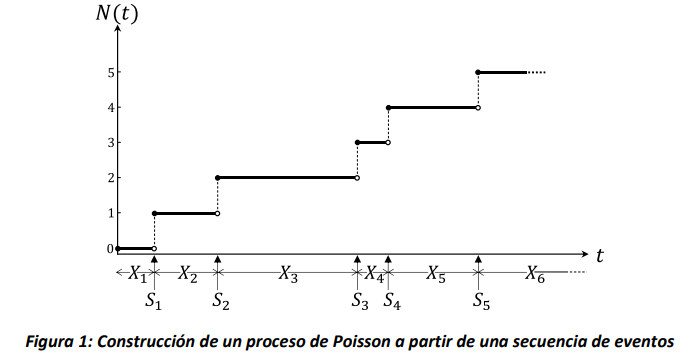

# Procesos de Poisson

En este capítulo se introduce el proceso estocástico conocido como
*Proceso de Poisson*. Se presentan las generalidades sobre este tipo de
proceso estocástico, y después se explican sus propiedades y relaciones
con las distribuciones de probabilidad de Poisson y la exponencial.
Varios ejemplos de aplicaciones son introducidos y analizados. Completan
el capítulo el resumen de los conceptos fundamentales y las preguntas
orientadoras.

## Introducción

Los procesos de Poisson son una clase particular de procesos
estocásticos. Reciben su nombre del matemático francés Siméon Denis
Poisson (1781--1840), el cual es conocido, entre otros, por la
distribución de probabilidad discreta de Poisson.

Los procesos de Poisson pertenecen a la familia de los procesos de
conteo, un tipo de procesos estocásticos de espacio discreto y en tiempo
continuo cuyo estado $N(t)$ en el tiempo $t$, $t \geq 0$, representa el
número total de ocurrencias de eventos en el intervalo
$\lbrack 0,t\rbrack$. Por ejemplo: $N(t) =$ El número de clientes que
llegan a un restaurante desde el momento 0 hasta el instante $t$;
$N(t) =$ El número de gaseosas envasadas en la línea de producción hasta
el instante $t$; $N(t)$ = el número de acciones de un banco vendidas
hasta el día $t$. Existen varias definiciones del proceso de Poisson.
Aquí consideraremos una que se acomoda a las necesidades de modelar
sistemas, en particular flujos de eventos de llegada.

### **Definición 2.1.1:**

Sea $X_{1},X_{2},\ldots$ una secuencia de variables aleatorias
independientes entre sí, cada una con distribución exponencial de
parámetro $\lambda$, es decir $X_{i}\sim Exp(\lambda)$, $i > 0$.
Definimos $S_{0} = 0$ y $S_{n} = \sum_{i = 1}^{n}X_{i}$, $n > 0$. Por
cada $n,\ \ n > 0$, el valor de $S_{n}$ corresponde al tiempo de
ocurrencia del $n$-esimo tiempo exponencial de la secuencia, y $S_{n}$
es una secuencia de tiempos creciente en $n$. Si se define
$N(t) = \max\left\{ n\  \right|\ S_{n} \leq t\}$, entonces
$\{ N(t),t \geq 0\}$ es un proceso de Poisson, de parámetro $\lambda$,
lo cual usualmente denotaremos como
$\left\{ N(t),t \geq 0 \right\}\sim PP(\lambda)$.

Según esta definición, el valor del estado del proceso $N(t)$ al tiempo
$t,\ \ t \geq 0$, corresponde al número de eventos que han ocurrido en
la ventana temporal $\lbrack 0,t\rbrack$, tal como se requiere para un
proceso de conteo. Como se ilustra en la Figura 1, el valor de la
variable de estado del proceso de Poisson aumenta una unidad cada vez
que se alcanza uno de los instantes de la secuencia $S_{n}$. Asimismo,
siempre se cumple que el valor de $N(t) = k$ en el instante $S_{k}$,
donde $k\mathbb{\in N}$, tal como se ilustra en la Figura 1 por los
círculos vacíos y rellenos, que marcan la discontinuidad de la función
lineal a trozos que representa la variación de la función del tiempo
$N(t)$.



El proceso de Poisson es ampliamente utilizado para modelar procesos de
llegada, por ejemplo, de usuarios a almacenes, bancos, parqueaderos, o
flujos de eventos tales como la emisión de partículas generada por el
decaimiento radiactivo. También, es comúnmente aplicado para modelar la
manera en la cual defectos de producción se distribuyen en los
materiales, por ejemplo, imperfecciones en la estructura molecular de
semiconductores, y otras aplicaciones de distribución espacial, por
ejemplo, la densidad de los usuarios de celulares en las ciudades. A
menudo es también utilizado para modelar fenómenos aleatorios en
disciplinas como biología, economía y física.

## Distribución Exponencial

Como se mencionó, el Proceso de Poisson es aplicado en el modelamiento
de diferentes sistemas donde la distribución exponencial representa el
tiempo entre eventos que ocurren en el sistema. Por este motivo, la
distribución exponencial es ampliamente estudiada ya que sus propiedades
ayudan a entender cómo se comportan estos sistemas.

##### **Definición 2.2.1:**

Una variable aleatoria $T \in \lbrack 0,\ \infty)$ es exponencial con
parámetro $\lambda > 0$ si su función de densidad de probabilidad es
$f_{T}(t) = \lambda e^{- \lambda t},\ t \geq 0$.

Para el cálculo de probabilidades, podemos apoyarnos en la función
acumulada de probabilidad de la distribución exponencial.

##### **Propiedad 2.2.1:**

Sea $T\sim\exp(\lambda)$ entonces su función acumulada de probabilidad
es $F_{T}(t) = 1 - e^{- \lambda t},\ t \geq 0$.

##### ***Demostración***

Dado que la distribución exponencial es una función continua, se tiene
que
$F_{T}(t) = P(T \leq t) = \int_{0}^{t}{\lambda e^{- \lambda s}ds\ }$.
Por lo que se tiene que

$$\int_{0}^{t}{\lambda e^{- \lambda s}ds\ } = {- e}^{- \lambda s}|_{0}^{t} = {- e}^{- \lambda t} - \left( - e^{0} \right) = 1 - e^{- \lambda t}$$

Dado que estamos tratando con una distribución de probabilidad, podemos
calcular diferentes medidas como el valor esperado y la varianza. Así
que:

$$E(T) = \int_{0}^{\infty}{t\lambda e^{- \lambda t}dt} = - te^{- \lambda t}|_{0}^{\infty} - \int_{0}^{\infty}{- e^{- \lambda t}dt} = 0 - \frac{e^{- \lambda t}}{\lambda}|_{0}^{\infty} = \frac{1}{\lambda}$$

$$Var(T) = E\left( T^{2} \right) - E^{2}(T) = \frac{1}{\lambda^{2}}$$

### **Ejercicio 1:**

```{admonition} Ejemplo 1
:class: suggestion
A un restaurante de comida rápida, llegan clientes a comprar
hamburguesas. Durante la hora pico, se sabe que la llegada de los
clientes se comporta como un Proceso de Poisson con tasa de
$\frac{1}{2}$ cliente por minuto. Dada esta información, calcule:

**a)**  La probabilidad de que el tiempo de llegada entre dos clientes
    consecutivos sea menor a 1 minuto.

**b)**  La probabilidad de que el tiempo de llegada entre dos clientes
    consecutivos sea mayor a 3 minutos.

**c)**  La probabilidad de que el tiempo de llegada entre dos clientes
    consecutivos esté entre 1 y 2 minutos.

**d)**  El valor esperado y la varianza del tiempo entre llegadas de
    clientes consecutivos.

```


**Solución:** denotamos con $T$ la variable aleatoria tiempo entre
llegadas. Dado que la llegada de clientes sigue un
$PP\left( \lambda = \frac{1}{2} \right)$ entonces el tiempo entre
llegadas de clientes $T\ $ se distribuye
$\exp\left( \lambda = \frac{1}{2} \right)$. Así que:

a)  $P(T < 1) = F(1) = 1 - e^{- \frac{1}{2} \cdot 1} = 1 - e^{- \frac{1}{2}}$

b)  $P(T > 3) = 1 - F(3) = 1 - \left( 1 - e^{- \frac{1}{2} \cdot 3} \right) = e^{- \frac{3}{2}}$

c)  $P(1 \leq T \leq 2) = F(2) - F(1) = \left( 1 - e^{- \frac{1}{2} \cdot 2} \right) - \left( 1 - e^{- \frac{1}{2} \cdot 1} \right) = e^{- \frac{1}{2}} - e^{- 1}$

d)  $E\lbrack T\rbrack = \frac{1}{\lambda} = \frac{1}{\frac{1}{2}} = 2\ \text{min},\ \ Var(T) = \frac{1}{\lambda^{2}} = \frac{1}{\left( \frac{1}{2} \right)^{2}} = 4{\ \text{min}}^{2}\ $

## Propiedades de la distribución Exponencial

### **Propiedad 2.3.1 (No memoria):** 

Sea $T\sim\exp(\lambda)$ entonces $\forall\ t,s \geq 0$ se tiene que
$P\left( T > t + s\  \middle| \ T > s \right) = P(T > t)$.

### ***Demostración***

Dado que $T\sim\exp(\lambda)$ entonces
$P\left( T > t + s\  \middle| \ T > s \right) = \frac{P(T > t + s,\ \ T > s)}{P(T > s)} = \frac{P(T > t + s)}{P(T > s)} = \frac{e^{- (t + s)\lambda}}{e^{- s\lambda}}$.
Por propiedades de exponentes entonces se tiene que
$\frac{e^{- (t + s)\lambda}}{e^{- s\lambda}} = e^{- (t + s)\lambda - ( - s\lambda)} = e^{- t\lambda} = P(T > t)$.

Suponga que la variable aleatoria $T$ representa un tiempo, por ejemplo,
el tiempo que toma realizar un ensamblaje en una estación de trabajo. La
propiedad de no memoria implica que, sin importar cuánto tiempo $s$ haya
transcurrido, la probabilidad de que el tiempo que falta para terminar
la tarea sea mayor a $t$ es igual. Es decir que es posible observar el
proceso en cualquier momento y determinar la probabilidad de que tome al
menos $t$ unidades de tiempo adicionales terminarlo, sin tener que
recordar cuándo empezó.

La propiedad de no memoria es fundamental para el cálculo de
probabilidades en procesos estocásticos como procesos de Poisson y
Cadenas de Markov que veremos más adelante. La distribución exponencial
es la única, dentro de las distribuciones de probabilidad continuas, que
cuenta con esta propiedad.

### **Propiedad 2.3.2:**

Sea $X\sim\exp(\lambda)\ y$ $Y\sim\exp(\mu)$ independientes y
$Z = min(X,Y)$, entonces $Z\sim exp(\lambda + \mu)$.

### ***Demostración***

Dado que $X\sim\exp(\lambda)$, $Y\sim\exp(\mu)$ entonces
$P(Z > t) = P\left( \min(X,Y) > T \right) = P(X > t,Y > t)$ y como
$X\ y\ Y$ son independientes entonces
$P(X > t,Y > t) = P(X > t)P(Y > t) = e^{- \lambda t}e^{- \mu t} = e^{- (\lambda + \mu)t}$

Si se extiende la propiedad a que
$X_{1}\sim\exp\left( \lambda_{1} \right),\ldots,\ X_{n}\sim exp(\lambda_{n})$
y $Z = min(X_{1},\ldots,X_{n})$ entonces
$Z\sim exp(\lambda_{1} + \ldots + \lambda_{n})$.

Esta propiedad nos permite calcular probabilidades cuando varias tareas
se encuentran en ejecución en paralelo, todas con tiempos que siguen una
distribución exponencial, e independientes entre sí. Considere el caso
de un call center en el que dos agentes atienden cada uno una llamada.
El tiempo mínimo entre las duraciones de las dos llamadas, representa el
tiempo en el que uno de los agentes queda libre. Este tiempo nos
interesa porque en ese momento el agente que ha quedado libre puede
tomar una nueva llamada. La Propiedad 2.3.2 nos permite determinar que,
si los tiempos de duración de las llamadas son exponenciales e
independientes, el tiempo hasta que el primer agente queda libre es
también exponencial. Además, el parámetro de la exponencial resultante
es la suma de las tasas del tiempo de cada llamada.

### **Propiedad 2.3.3:**

Sea $X\sim\exp(\lambda)\ y$ $Y\sim\exp(\mu)$ independientes, entonces
$P(X < Y) = \frac{\lambda}{\lambda + \mu}$.

### ***Demostración***

Para demostrar que $P(X < Y)$ hay que demostrar que para todo valor de
$t$ la variable aleatoria $X$ debe ser menor que la variable aleatoria
$Y$. Para esto se sabe que
$P(X < Y) = \int_{0}^{\infty}{P\left( X < Y \middle| X = t \right)\lambda e^{- \lambda t}dt} = \int_{0}^{\infty}{P(t < Y)\lambda e^{- \lambda t}dt} = \int_{0}^{\infty}{e^{- \mu t}\lambda e^{- \lambda t}dt} =$
$\lambda\int_{0}^{\infty}{e^{- (\lambda + \mu)t}dt} = \lambda*\  - \frac{e^{- (\lambda + \mu)t}}{\lambda + \mu}|_{0}^{\infty} = 0 + \frac{\lambda}{\lambda + \mu} = \frac{\lambda}{\lambda + \mu}$

Si se extiende la propiedad a que
$X_{1}\sim\exp\left( \lambda_{1} \right),\ldots,\ X_{n}\sim exp(\lambda_{n})$
y se desea calcular $P(X_{i} < X_{1},\ldots,X_{n}\ )$ entonces
$P\left( X_{i} < X_{1},\ldots,X_{n}\  \right) = \frac{\lambda_{i}}{\lambda_{1} + \ldots + \lambda_{n}}.$

La Propiedad 2.3.3. también es útil cuando tenemos tareas que se
ejecutan en paralelo. En el ejemplo anterior de los dos agentes en un
call center, esta propiedad nos permite calcular la probabilidad de uno
de los dos agentes sea el primero en quedar disponible. La propiedad nos
muestra además que, si el primer agente es más rápido y tiene por lo
tanto un tiempo exponencial con una tasa $\lambda$ mayor que la del
segundo agente, es más probable que termine primero. En el caso en que
los tiempos de atención de los dos agentes tengan la misma tasa, tendrán
la misma probabilidad de terminar primero (0.5).

### **Propiedad 2.3.4:**

Sea $X_{i}\sim\exp(\lambda)\ \forall\ 1 \leq i \leq n$ y $S_{n}$ la suma
de $n$ variables, $S_{n} = \sum_{i = 1\ }^{n}X_{i}$, entonces $S_{n}$ se
distribuye $Erlang(\lambda,n)$, con función de densidad de probabilidad
$f_{S_{n}}(t)$, valor esperado $E\left( S_{n} \right)$ y varianza
$Var\left( S_{n} \right)$, dadas por:

$$f_{S_{n}}(t) = \frac{\lambda^{n}t^{n - 1}e^{- \lambda t}}{(n - 1)!}\ \forall\ t \geq 0$$

$$E\left( S_{n} \right) = \frac{n}{\lambda}\ \ \ \ \ y\ \ \ \ Var\left( S_{n} \right) = \frac{n}{\lambda^{2}}$$

Finalmente, la Propiedad 2.3.4 nos permite calcular probabilidades
cuando tenemos tareas que se ejecutan en serie. En el caso del call
center, suponga que un agente debe atender de manera sucesiva y sin
pausa, 5 llamadas. Si cada una de las llamadas toma un tiempo
exponencial con tasa $\lambda$, y su duración es independiente, el
tiempo que le toma al agente concluir las 5 llamadas sigue una
distribución $Erlang(\lambda,n = 5)$. Así, podemos calcular ahora el
valor esperado, varianza y probabilidades asociadas al tiempo de
atención de las 5 llamadas.

## Propiedades de los procesos de Poisson

### **Propiedad 2.4.1:** 

Si un flujo de eventos se distribuye como un proceso de Poisson de
parámetro $\lambda$, el número de eventos que ocurre en el intervalo
$\lbrack 0,t\rbrack$ se distribuye como una variable de Poisson de
parámetro $\lambda t$, $t \geq 0$, es decir
$N(t)\sim Poisson(\lambda t)$.

### ***Demostración***

Observamos que la probabilidad de que el número de eventos en el
intervalo $\lbrack 0,t\rbrack$ sea igual a un valor entero no-negativo
$n \geq 0$, es decir $P\left\lbrack N(t) = n \right\rbrack$ se puede
escribir como sigue:

$P\left\lbrack N(t) = n \right\rbrack = P\left\lbrack N(t) < n + 1 \right\rbrack - P\left\lbrack N(t) < n \right\rbrack$.

La igualdad anterior resulta de la definición de la distribución
acumulada para variables discretas: la resta de probabilidades en el
lado derecho de la ecuación solo puede contemplar el caso que la
variable aleatoria $N(t)$ asuma exactamente el valor $n$. Ahora bien, ya
que
$P\left\lbrack N(t) < n \right\rbrack = 1 - P\left\lbrack N(t) \geq n \right\rbrack\ $podemos
escribir lo anterior como sigue:

$$P\left\lbrack N(t) < n + 1 \right\rbrack - P\left\lbrack N(t) < n \right\rbrack = 1 - P\left\lbrack N(t) \geq n + 1 \right\rbrack - \left( 1 - P\left\lbrack N(t) \geq n \right\rbrack \right) =$$

$= P\left\lbrack N(t) \geq n \right\rbrack - P\left\lbrack N(t) \geq n + 1 \right\rbrack$.

Observamos ahora que si en el intervalo $\lbrack 0,t\rbrack$ se observan
al menos $n$ eventos, entonces el tiempo de ocurrencia del $n$-esimo
evento debe ser menor o igual a $t$, es decir que
$P\left\lbrack N(t) \geq n \right\rbrack = P\lbrack S_{n} \leq t\rbrack$.
Por lo tanto, podemos escribir lo siguiente:

$$P\left\lbrack N(t) \geq n \right\rbrack - P\left\lbrack N(t) \geq n + 1 \right\rbrack = P\left\lbrack S_{n} \leq t \right\rbrack - P\lbrack S_{n + 1} \leq t\rbrack$$

Dado que $S_{n}$ es la suma de $n$ variables exponenciales
independientes e idénticamente distribuidas de parámetro $\lambda$*,* su
distribución es Erlang $(Erl)$, con $n$ estadios y tasa $\lambda,$ o sea
$\ S_{n}\sim Erl(n,\ \lambda)$. Entonces, de la fórmula de la
distribución acumulada de la Erlang se obtiene:

$$P\left\lbrack S_{n} \leq t \right\rbrack = 1 - e^{- \lambda t}\sum_{j = 1}^{n - 1}\frac{{(\lambda t)}^{j}}{j!}$$

Por lo cual podemos escribir la diferencia anterior como sigue:

$$P\left\lbrack S_{n} \leq t \right\rbrack - P\left\lbrack S_{n + 1} \leq t \right\rbrack = 1 - e^{- \lambda t}\sum_{j = 1}^{n - 1}\frac{(\lambda t)^{j}}{j!} - \left( 1 - e^{- \lambda t}\sum_{j = 1}^{n}\frac{(\lambda t)^{j}}{j!} \right) =$$

$= e^{- \lambda t}\sum_{j = 1}^{n}\frac{(\lambda t)^{j}}{j!} - e^{- \lambda t}\sum_{j = 1}^{n - 1}\frac{(\lambda t)^{j}}{j!} = e^{- \lambda t}\frac{{(\lambda t)}^{n}}{n!}$.

Entonces se obteniendo que:

$P\left\lbrack N(t) = n \right\rbrack = e^{- \lambda t}\frac{{(\lambda t)}^{n}}{n!}$,

o sea $N(t)\sim Poisson(\lambda t)$

### **Propiedad 2.4.2 (Incrementos independientes):** 

Si $\{ N(t),t \geq 0\}$ es un proceso de Poisson con parámetro $\lambda$
entonces para cualquier
$0 \leq s \leq t \leq u \leq v\ \text{e}\ i,j \geq 0$ se tiene que
$P\left( N(v) - N(u) = j|N(t) - N(s) = i \right) = P(N\left( v) - N(u \right) = j)$.
Lo anterior implica que los eventos no dependen de lo ocurrido
anteriormente, sino de la ventana temporal en la que se observó el
sistema $(v - u).$

### **Propiedad 2.4.3 (Incrementos estacionarios):**

Si $\{ N(t),t \geq 0\}$ es un proceso de Poisson con parámetro
$\lambda$, entonces, para cualquier
$0 \leq s \leq t\ \ \text{e}\ i \geq 0$ se tiene que
$P\left( N(t + s) - N(s) = i \right) = P(N(t) = i)$. Esto refleja que
cambios en el proceso de igual tamaño ($\ i$) y en intervalos de la
misma duración ($t$) son iguales en términos de probabilidad sin
importar el momento del tiempo en el que ocurran ($s$).

### **Propiedad 2.4.4:**

Sea $S_{n}$ el tiempo de ocurrencia hasta el n-ésimo evento en un
proceso de Poisson con parámetro $\lambda$, entonces
$S_{n}\sim Erlang(\lambda,n)$. (Misma propiedad 2.3.4)

### **Propiedad 2.4.5 (Combinación de procesos de Poisson):**

Sean $\left\{ N_{i}(t),t \geq 0 \right\}\ \ \forall 1 \leq i \leq n$
procesos de Poisson con parámetro $\lambda_{i}$ respectivamente, e
independientes entre sí. Si $N(t) = \sum_{i = 1}^{n}{N_{i}(t)}$,
entonces $\{ N(t),t \geq 0\}$ es un proceso de Poisson con parámetro
$\lambda = \lambda_{1} + \ldots + \lambda_{n}$. (Misma propiedad 2.3.2).

### **Propiedad 2.4.6:** {#propiedad-2.4.6 .unnumbered}

Sea $\left\{ N(t),t \geq 0 \right\}$ un proceso de Poisson con parámetro
$\lambda$ y suponga que cada evento se puede clasificar en la categoría
$i$ con probabilidad $p_{i}$, entonces $\{ N_{i}(t),t \geq 0\}$ es un
proceso de Poisson para los eventos de categoría $i\ $con parámetro
$\lambda_{i} = p_{i}\lambda$. (Misma propiedad 2.3.3).

### **Ejercicio 2:**

```{admonition} Ejercicio 2
:class: suggestion

Suponga que a un restaurante llegan dos tipos de clientes: el tipo de
Cliente 1 va a almorzar y el tipo de Cliente 2 va a comer postre. Los
clientes de tipo 1 llegan al restaurante de acuerdo con un proceso de
Poisson con parámetro (tasa) de 10 clientes por hora, mientras, los
clientes tipo 2 llegan de acuerdo con un proceso de Poisson con
parámetro (tasa) de 5 clientes por hora. Responda las siguientes
preguntas con la información suministrada:

**a)**  Calcule la probabilidad de que lleguen 5 clientes que van a almorzar
    entre las 10:00 am y las 12:00 m.

**b)**  Calcule la probabilidad de que lleguen máximo 3 clientes que van a
    comer postre entre las 2:00 pm y las 3:00 pm.

**c)**  Calcule la probabilidad de que entre las 12:00 m y la 1:00 pm
    lleguen a almorzar 5 clientes dado que se sabe que entre las 11:00
    am y las 2:00 pm llegaron a almorzar 10 clientes.

**d)**  Calcule la probabilidad de que entre las 2:00 pm y las 3:00 pm
    lleguen 10 clientes ya sea a almorzar o a pedir postre.

```
