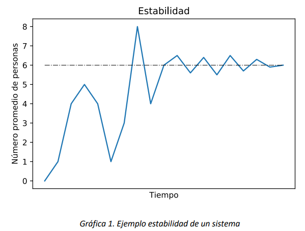

# Probabilidades en estado estable

En este capítulo se presenta la definición, cálculo y uso de las
probabilidades en estado estable. Tanto para cadenas de Markov de tiempo
continuo como para cadenas de Markov de tiempo discreto, se presentarán
ejemplos prácticos y usos frecuentes de estas probabilidades.

## Introducción

Un sistema, al momento de ser observado por primera vez, está en sus
condiciones iniciales. Por ejemplo, un banco vacío cuando abre, una
planta de producción recibiendo las órdenes a producir durante el día o
un call center donde los trabajadores están esperando las llamadas. A
partir del estado inicial, un sistema evoluciona en el tiempo, y puede
llegar a alcanzar una condición denominada *estabilidad* o *estado
estacionario* (en inglés, *steady-state* o *stationary state*).

Los modelos de cadena de Markov (en tiempo discreto o continuo) pueden
igualmente evolucionar en el tiempo hasta alcanzar el estado
estacionario. Es posible demostrar que la propiedad de ergodicidad es
suficiente para que una cadena de Markov tenga estado estable.

Hasta que una cadena de Markov no llegue a un punto en donde esté en
condiciones de estabilidad, su comportamiento es de tipo transitorio y
debe ser analizado utilizando las técnicas del análisis transitorio. El
tiempo que se demora para llegar a esta estabilidad se conoce como
*tiempo de calentamiento*, y cada sistema/modelo tiene un tiempo de
calentamiento diferente. Por ejemplo, el número promedio de personas en
un banco puede tener el siguiente comportamiento:



Se puede apreciar que el número de personas se estabiliza alrededor del
valor de 6 personas en el banco. Desde este punto se determina la
estabilidad. Ahora bien, como cada sistema se comporta de forma
diferente se puede concluir que, para el modelo de un sistema que admita
estado estable, cuando el tiempo tiende a infinito el modelo llega
seguramente a una estabilidad.

En particular, si una cadena de Markov con espacio de estados $S$ admite
estado estable, se observa que, en el largo plazo, cuando el tiempo
(discreto o continuo) tiende al infinito, existen los siguientes
límites:


> $\lim_{t \rightarrow \infty}{P\left\lbrack X(t) = j \middle| X(0) = i \right\rbrack = \pi_{j}\ ,\ \forall\ i,j \in S}$     si la cadena es continua

>$\lim_{n \rightarrow \infty}{P\left\lbrack X_{n} = j \middle| X_{0} = i \right\rbrack = \pi_{j}\ ,\ \forall\ i,j \in S}$   si la cadena es discreta


Observamos que no solo los límites $\pi_{j}$ existen por cada estado,
sino que son independientes del estado inicial de la cadena de Markov.
Esta independencia del estado inicial resulta de la ergodicidad del
modelo, en particular de la irreducibilidad. Cuando una cadena es
ergódica, las probabilidades límite $\pi_{j}$, $j \in S$, son
equivalentes a las probabilidades de estado estable, y el vector
$\overrightarrow{\pi}$ de las probabilidades de estado estable es el
*vector de distribución estacionaria de estado* (*steady-state
probability distribution vector*, en inglés). Al ser un vector de
probabilidades, la suma de los elementos de $\overrightarrow{\pi}$ tiene
que ser unitaria, es decir:

$$\sum_{i \in S}^{}\pi_{i} = 1$$

## Cálculo de las probabilidades en estado estable para CMTD

Para una cadena de Markov de tiempo discreto se puede calcular las
probabilidades en estado estable conociendo que:

$$\lim_{n \rightarrow \infty}P\left\lbrack X_{n} = j \middle| X_{0} = i \right\rbrack = \lim_{n \rightarrow \infty}\mathbb{P}_{ij}^{n}$$

Pero esto quiere decir que se debería elevar la matriz $\mathbb{P\ }$al
infinito, o, si se acepta una aproximación, por lo menos calcular una
potencia muy grande de $\mathbb{P}$. Dado que este cálculo puede ser muy
costoso en términos computacionales, es necesario utilizar otro
procedimiento. La siguiente propiedad de las CMTD proporciona una manera
más efectiva de calcular la distribución de estado estable.

### **Propiedad:** 

Para una CMTD $\{ X_{n},n \geq 0\}$ ergódica, con espacio de estados $S$
y matriz de probabilidades de transición a un paso $\mathbb{P}$, las
probabilidades en estado estable son calculadas resolviendo el siguiente
sistema de ecuaciones:

1.  $\overrightarrow{\pi}\mathbb{P =}\overrightarrow{\pi}$ (Ecuaciones
    de balance)

2.  $\sum_{i \in S}^{}\pi_{i} = 1$ (Ecuación de normalización)

La primera expresión se puede interpretar así: Si una cadena se
encuentra en estado estable, es decir, si la cadena se encuentra en el
estado $i$ con probabilidad $\pi_{i}$ para todo $i \in S$, tras una
transición de acuerdo con la matriz $\mathbb{P}$, la cadena seguirá en
cada estado con la misma probabilidad, i.e., en cada estado $i \in S$
estará con probabilidad $\pi_{i}$. La segunda afirmación hace referencia
al hecho de que $\overrightarrow{\pi}$ es un vector estocástico, y por
ende la suma de todos sus elementos debe ser igual a uno.
Adicionalmente, cabe resaltar que existen tantas ecuaciones de balance
como estados en la cadena, $n = \ |S|$, y que estas son linealmente
dependientes entre si (el sistema tiene infinitas soluciones). Por esta
razón, a la hora de calcular las probabilidades se deben usar $n - 1$
ecuaciones de balance, más la ecuación de normalización.

```{admonition} Ejemplo
:class: suggestion

Una tienda de televisores tiene una capacidad para mantener
en inventario máximo 3 unidades. Si al final de la semana (domingo) no
tiene televisores en inventario, se piden nuevas unidades hasta llenar
el inventario. Este pedido llega al principio de la semana siguiente
(lunes) a primera hora.

Se sabe que la demanda de televisores por semana se comporta de la
siguiente forma: 0 televisores con probabilidad de $\frac{1}{4}$, 1
televisor con probabilidad de $\frac{1}{2}$ y 2 televisores con
probabilidad de $\frac{1}{4}$. Si la demanda no puede ser abastecida en
una semana, aun así, vende la mayor cantidad de televisores posibles.
Determine las probabilidades en estado estable del inventario.

```

```{admonition} Solución Ejemplo
:class: suggestion

Se define la variable como
$X_{n} = El\ número\ de\ televisores\ en\ inventario\ al\ principio\ de\ la\ n - \text{ésima semana}$.
Por lo que el espacio de estados es $S = \{ 1,2,3\}$. Este no contiene
el 0, dado que, al definir el periodo de observación de la variable al
inicio de la semana, si el domingo no hay unidades en el inventario, se
pedirán 3 unidades hasta saturar el sistema. En caso que haya una o más
unidades en inventario al final de la semana (domingo), no se pedirán
unidades. Esto muestra que, de acuerdo con la definición de la
temporalidad de $X_{n}$, el estado $X_{n} = 0$ nunca se observará.

:::{warning} **Nota:**
    Considere que, si la definición de la variable cambia, y ahora se
    observara al final de la semana, sería posible observar el estado
    $X_{n} = 0$. Reflexione sobre cómo cambiaría la matriz de
    probabilidades con esta nueva variable.
:::

Por ejemplo, si el domingo se finalizara con una unidad, no se
realizaría ningún pedido, y se iniciaría el lunes $n$ con dicha unidad.
Para que el siguiente lunes $(n + 1)$ siga existiendo una unidad en
inventario, en la semana no se debe demandar ninguna unidad, lo cual
sucede con probabilidad de $\frac{1}{4}$. Adicionalmente, la transición
de tener 1 unidad en el inventario y pasar a 3 unidades requiere que la
demanda en la semana haya sido de 1 o más unidades, lo que lleva a tener
cero unidades en el inventario, y realizar el pedido el día domingo. Lo
anterior se puede resumir como: $p_{1,1} = \frac{1}{4},\ $ y
$p_{1,3} = \frac{3}{4}$.

Siguiendo la misma lógica para el resto de los casos, se tiene entonces
que la matriz de probabilidades de transición está expresada por:

$$\mathbb{P = \ }\begin{matrix}
\  & \begin{matrix}
1\ \  & \ 2\  & \ \ 3
\end{matrix} \\
\begin{matrix}
1 \\
2 \\
3
\end{matrix} & \begin{bmatrix}
1/4 & 0 & 3/4 \\
1/2 & 1/4 & 1/4 \\
1/4 & 1/2 & 1/4
\end{bmatrix}
\end{matrix}$$

Para calcular las probabilidades en estado estable, primero hay que
formular las ecuaciones de balance
$\left( \overrightarrow{\pi}\mathbb{P =}\overrightarrow{\pi} \right)$:

$$\overrightarrow{\pi}\mathbb{P =}\overrightarrow{\pi} = > \ \begin{bmatrix}
\pi_{1} & \pi_{2} & \pi_{3}
\end{bmatrix}\begin{bmatrix}
1/4 & 0 & 3/4 \\
1/2 & 1/4 & 1/4 \\
1/4 & 1/2 & 1/4
\end{bmatrix} = \begin{bmatrix}
\pi_{1} & \pi_{2} & \pi_{3}
\end{bmatrix}$$

$$\frac{1}{4}\pi_{1} + \frac{1}{2}\pi_{2} + \frac{1}{4}\pi_{3} = \pi_{1}$$

$$0\pi_{1} + \frac{1}{4}\pi_{2} + \frac{1}{2}\pi_{3} = \pi_{2}$$

$$\frac{3}{4}\pi_{1} + \frac{1}{4}\pi_{2} + \frac{1}{4}\pi_{3} = \pi_{3}$$

Adicionalmente, se debe agregar la ecuación de normalización:

$$\pi_{1} + \pi_{2} + \pi_{3} = 1$$

Dado que las ecuaciones de balance son linealmente dependientes entre
sí, se debe escoger 2 de estas ecuaciones más la de normalización para
resolver el sistema. Al resolver el sistema de ecuaciones, las
probabilidades en estado estable resultantes son:

$$\pi_{1} = \frac{7}{22},\ \pi_{2} = \frac{6}{22},\ \pi_{3} = \frac{9}{22}
$$

El anterior resultado implica que, en estado estable, la probabilidad de
que en una semana cualquiera se inicie con 1,2 y 3 televisores en
inventario, es de $\frac{7}{22}$, $\frac{6}{22}$ y $\frac{9}{22}$,
respetivamente.

```

## Probabilidades en estado estable para CMTC

Para una cadena de Markov de tiempo continuo, a diferencia de una de
tiempo discreto, se cuenta con una matriz generadora conocida como
$\mathbb{Q}$. Para las CMTC, el cálculo de las probabilidades de estado
estable se basa en la siguiente propiedad:

### **Propiedad:**

Para una CMTC $\{ X(t),t \geq 0\}$ ergódica, con espacio de estados $S$
y matriz generadora $\mathbb{Q}$, las probabilidades en estado estable
son calculadas resolviendo el siguiente sistema de ecuaciones

1.  $\overrightarrow{\pi}\mathbb{Q =}\overrightarrow{0}$ (Ecuaciones de
    balance)

2.  $\sum_{i \in S}^{}\pi_{i} = 1$ (Ecuación de normalización)

En la primera expresión, considere la primera entrada del producto
$\overrightarrow{\pi}\mathbb{Q}$, que es el resultado de multiplicar el
vector fila $\overrightarrow{\pi}$ por la primera columna de
$\mathbb{Q}$. La primera columna contiene la tasa de salida del primer
estado (negativa) y las tasas de entrada al primer estado desde
cualquier otro estado. El producto de $\overrightarrow{\pi}$ por la
primera columna de $\mathbb{Q}$ tiene entonces una suma positiva de
tasas de entrada al primer estado, más la tasa de salida (negativa),
ponderados por la probabilidad de estado estable asociada a cada estado.
Si este producto es igual a cero, la tasa de salida es igual a la tasa
entrada, y por lo tanto no se esperan cambios en la probabilidad. Así,
la distribución de estado estable logra balancear las probabilidades
para que las tasas de entrada y salida sean iguales en estado estable.
La segunda condición captura que $\overrightarrow{\pi}$ es un vector
estocástico, luego sus entradas deben sumar uno.

```{admonition} Ejemplo
:class: suggestion

Un banco cuenta con dos cajeros donde cada uno tiene un
tiempo de atención que se distribuye exponencial con tasa de 10 personas
por hora. Por otro lado, llegan clientes al banco en promedio cada 12
minutos. Se conoce que el banco tiene espacio a lo sumo de 1 persona en
fila y que el tiempo entre llegadas de clientes se distribuye
exponencial. Determine las probabilidades en estado estable del número
de personas en el banco.

```

```{admonition} Solución Ejemplo
:class: suggestion


```

*Solución.*

Se define la variable como
$X(t) = \ El\ número\ de\ personas\ en\ el\ banco\ en\ cualquier\ momento\ t$.
Considerando que como máximo se pueden estar atendiendo dos personas,
más la que se encuentra en la fila, el espacio de estados se define como
$S = \{ 0,1,2,3\}$. Ahora, aplicando el concepto de mínimo de
exponenciales (visto en la lectura *2-Procesos de Poisson*), y usando la
tasa de llegada y la tasa de atención, se sabe entonces que la matriz
generadora se puede representar como:

$$\mathbb{Q =}\begin{matrix}
\  & \begin{matrix}
0 & \ \ \ 1\ \  & \ \ \begin{matrix}
\ \ \ 2\  & \ \ \ 3
\end{matrix}
\end{matrix} \\
\begin{matrix}
0 \\
1 \\
\begin{matrix}
2 \\
3
\end{matrix}
\end{matrix} & \begin{bmatrix}
 - 5 & 5 & \begin{matrix}
\ \ 0\ \ \  & 0
\end{matrix} \\
10 & - 15 & \ \ \begin{matrix}
5\ \ \  & 0
\end{matrix} \\
\begin{matrix}
0 \\
0
\end{matrix} & \begin{matrix}
20 \\
0
\end{matrix} & \begin{matrix}
\begin{matrix}
 - 25 \\
20
\end{matrix} & \begin{matrix}
5 \\
 - 20
\end{matrix}
\end{matrix}
\end{bmatrix}
\end{matrix}$$

Para calcular las probabilidades en estado estable, primero hay que
formular las ecuaciones de balance
$\left( \overrightarrow{\pi}\mathbb{Q =}\overrightarrow{0} \right)$:

$$\overrightarrow{\pi}\mathbb{Q =}\overrightarrow{0} = > \begin{bmatrix}
\begin{matrix}
\pi_{0} & \pi_{1}
\end{matrix} & \pi_{2} & \pi_{3}
\end{bmatrix}\begin{bmatrix}
 - 5 & 5 & \begin{matrix}
\ \ 0\ \ \  & 0
\end{matrix} \\
10 & - 15 & \ \ \begin{matrix}
5\ \ \  & 0
\end{matrix} \\
\begin{matrix}
0 \\
0
\end{matrix} & \begin{matrix}
20 \\
0
\end{matrix} & \begin{matrix}
\begin{matrix}
 - 25 \\
20
\end{matrix} & \begin{matrix}
5 \\
 - 20
\end{matrix}
\end{matrix}
\end{bmatrix} = \begin{bmatrix}
\begin{matrix}
0 & 0
\end{matrix} & 0 & 0
\end{bmatrix}$$

$$- 5\pi_{0} + 10\pi_{1} = 0$$

$$5\pi_{0} - 15\pi_{1} + 20\pi_{2} = 0$$

$$5\pi_{1} - 25\pi_{2} + 20\pi_{3} = 0$$

$$5\pi_{2} - 20\pi_{3} = 0$$

Aparte se debe agregar la ecuación de normalización:

$$\pi_{0} + \pi_{1} + \pi_{2} + \pi_{3} = 1$$

Dado que las ecuaciones de balance son linealmente dependientes entre
sí, se debe escoger 3 de estas ecuaciones más la de normalización para
resolver el sistema. Al resolver el sistema de ecuaciones, las
probabilidades en estado estable resultantes son:

$$\pi_{0} = \frac{32}{53},\ \pi_{1} = \frac{16}{53},\ \pi_{2} = \frac{4}{53},\ \pi_{3} = \frac{1}{53}$$

Esto implica que, en el largo plazo, la probabilidad de que el banco se
encuentre vacío en cualquier momento del tiempo es de $\frac{32}{53}$,
mientras la probabilidad de que haya 1 cliente es $\frac{16}{53}$, 2
clientes $\frac{4}{53}$, y finalmente 3 clientes $\frac{1}{53}$.

