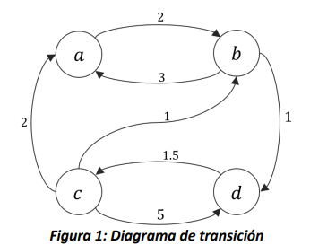

# Cadenas embebidas

En este capítulo se define una relación importante entre las cadenas de
Markov en tiempo continuo y aquellas en tiempo discreto. En particular,
se detalla la manera en la cual es posible obtener de una cadena de
Markov en tiempo continuo, cadenas en tiempo discreto *embebidas*, en
inglés *embedded*. Se presentan algunos ejemplos y se explican las
correspondencias que existen entre las versiones continuas y discretas
de los modelos.

## Introducción

Cuando se quiere modelar la evolución de un sistema con un proceso
estocástico Markoviano, el primer paso del modelado es la elección del
tipo de modelo.

Las cadenas de Markov pueden ser de tiempo continuo o de tiempo
discreto. Las cadenas en tiempo continuo modelan cambios de estado del
sistema que se pueden dar en cualquier momento en el tiempo, es decir
que proporcionan un modelo capaz de capturar la dinámica completa del
sistema en el tiempo. Por otra parte, los modelos en tiempo discreto
únicamente contemplan la posibilidad de cambio de estado en una
secuencia elegida de puntos en el tiempo. Por ende, es posible que los
modelos en tiempo discreto no observen todos los cambios de estado.

Para determinar cuál debería ser el tipo de cadena de Markov a modelar,
con el fin de estudiar un sistema de interés, resulta pertinente
considerar los siguientes tres elementos:

-   La pregunta que se quiere contestar, es decir, qué es lo que se
    pretende medir con el modelo. Si sólo estamos interesados en
    revisiones periódicas del estado del sistema, probablemente no sea
    relevante conocer su evolución para todos los valores del tiempo.

-   Los datos que se tienen disponibles. Para modelar un sistema como
    una cadena de Markov de tiempo continuo, es necesario conocer las
    distribuciones de probabilidad de acuerdo con las que ocurren los
    eventos que llevan a cambios de estado. Además, es necesario que
    todas las distribuciones sean exponenciales e independientes. Por el
    contrario, para caracterizar una cadena de Markov en tiempo
    discreto, solo se necesitan probabilidades de transición entre
    estados.

-   Cuando sea posible optar por ambas posibilidades, la mejor decisión
    siempre es aquella que nos lleva al modelo más sencillo en términos
    de tamaño (estados y transiciones), ya que eso determina la
    complejidad de la definición y la solución del modelo mismo.

Cuando se opte por modelar con una cadena Markov en tiempo continuo
$\{ X(t),\ t \geq 0\}$, se está construyendo una representación del
sistema que permite estudiar su evolución a través del tiempo, ya que,
en principio, es posible conocer la distribución de probabilidad del
estado del proceso para cualquier valor del índice $t$. Esto implica que
también es posible estudiar la evolución del modelo en una secuencia
(finita o numerable) de puntos en el tiempo.

## Definición de cadenas embebidas

Si se define una secuencia de puntos de observación en el tiempo
$\tau_{0},\ \tau_{1},\tau_{2},\ldots$ a partir de un proceso estocástico
en tiempo continuo $\{ X(t),\ t \geq 0\}$, es posible definir el proceso
estocástico en tiempo discreto $\{ Z_{n},\ n \geq 0\}$, tal que

$Z_{n} ≝ X(\tau_{n})$, por cada $n \geq 0$,

ya que cualquier secuencia de momentos de observación
$\tau_{0},\ \tau_{1},\tau_{2},\ldots$, está contenida en el conjunto de
índices del proceso en tiempo continuo $\{ X(t),\ t \geq 0\}$. En este
caso, se dice que el proceso estocástico $\{ Z_{n},\ n \geq 0\}$ en
tiempo discreto es un proceso *embebido* del proceso en tiempo continuo.
Además, se puede determinar que cuando $\{ X(t),\ t \geq 0\}$ es una
cadena de Markov, $\left\{ Z_{n},\ n \geq 0 \right\}$ también lo es. Por
ejemplo, respecto a las probabilidades condicionales de ambas cadenas,

$$P\left\lbrack Z_{n} = i|Z_{n - 1} = k \right\rbrack = P\left\lbrack X\left( \tau_{n} \right) = i|X\left( \tau_{n - 1} \right) = k \right\rbrack,$$

y para las probabilidades marginales,

$P\left\lbrack X(\tau_{n}) = i \right\rbrack = P\left\lbrack Z_{n} = i \right\rbrack$.

Entre los motivos por los cuales puede ser útil la definición de cadenas
embebidas, resulta pertinente el hecho de que varios aspectos de las
cadenas de Markov de tiempo continuo pueden ser estudiados con mayor
facilidad en cadenas discretas embebidas.

## La cadena embebida - EMC

Entre todas las infinitas cadenas embebidas que pueden ser definidas a
partir de un proceso de Markov de tiempo continuo, existe una que se
llama "la cadena embebida" (en inglés, *the Embedded Markov Chain* --
EMC) del proceso en tiempo continuo. Esta cadena se obtiene agregando
las tasas de las distribuciones exponenciales en probabilidades
condicionales de un salto. Corresponde a seleccionar como puntos de
observación discretos, todos los momentos en el tiempo inmediatamente
después a aquellos en los cuales el estado de la cadena continua cambia.

Consideramos una cadena de Markov en tiempo continuo
$\{ X(t),\ t \geq 0\}$, con espacio de estados $S\ $y matriz de tasas de
transición $Q$, se tiene en la cadena embebida $\{ Z_{n},\ n \geq 0\}$
que:

1.  El espacio de estados de la EMC es igual a $S$.

2.  Para todo $i,j \in S$, $i \neq j$, la probabilidad de transición
    entre el estado $i$ y el estado $j$ se define como\
    $p_{ij} = - q_{ij}/q_{ii}$ si ${q}_{ii} \neq 0$.

3.  Para todo $i,j \in S$, $i \neq j$, la probabilidad de transición
    $p_{ij} = 0$ si $q_{ii} = 0$.

4.  Para todo $i \in S$, la probabilidad de transición $p_{ii}$ es nula
    si $q_{ii} \neq 0$, y es 1 si $q_{ii} = 0$.

5.  El tiempo que pasa entre cada par de observaciones de la cadena de
    Markov no necesariamente es igual
    ($\tau_{1} - \tau_{0} \neq \tau_{2} - \tau_{1} \neq \ldots \neq \tau_{n} - \tau_{n - 1}$),
    al ser los momentos de observación dependientes de variables
    exponenciales.

La matriz $P$ que se define según las expresiones 2, 3 y 4, debe cumplir
las mismas propiedades que cualquier matriz de transición en tiempo
discreto, esto es, todos sus elementos son números entre 0 y 1, y la
suma de cada fila es unitaria.

Demostrar que la suma de la fila sea unitaria se puede hacer de la
siguiente manera. Por cada fila $i$, si $q_{ii} = 0$, sigue que el único
elemento no nulo de la fila de la matriz $P$ es $p_{ii} = 1$; si
$q_{ii} \neq 0$, entonces se tiene que la suma de los elementos de la
fila $i$ es:

$$\sum_{j\epsilon S\ j \neq i\ }^{\ }p_{ij} = - \sum_{j\epsilon S\ j \neq i\ }^{\ }\frac{q_{ij}}{q_{ii}} = \frac{1}{q_{ii}}\sum_{j\epsilon S\ j \neq i\ }^{\ }\left( - q_{ij} \right) = \frac{1}{q_{ii}}q_{ii} = 1\ ,\ \ \forall i \in S\ |q_{ii} \neq 0.$$

Por la manera en la cual se definen las probabilidades, la EMC tiene una
probabilidad de transición no nula por cada tasa de transición no nula
en la cadena continua original. Dado que los espacios de estados son
iguales, el diagrama de tasas de la cadena continua original y el
diagrama de transición de la EMC son isomorfos, excepto por los estados
absorbentes de la CMTC[^1], que no tienen reciclo en la versión continua
del proceso y sí lo tienen en la EMC. En efecto, la EMC es fácil de
construir a partir de la inspección del diagrama de estado transición
del proceso en tiempo continuo.

Por ejemplo, si consideramos el siguiente diagrama (Figura 1), asociado
a una cadena de Markov en tiempo continuo $\{ X(t),\ t \geq 0\}$,



Es posible construir su respectiva matriz de tasas de transición,
recordando que los elementos de la diagonal corresponden a la suma
negativa de los valores de la fila, por lo cual

$$\mathbf{Q} = \left( \begin{matrix}
\begin{matrix}
 - 2 & 2\ \ \  \\
\ 3 & - 4\ \ \ \ \ \ 
\end{matrix} \\
\begin{matrix}
\ \ 2\ \  & \ \ \ 1\ \ \ \ \ \  \\
\ 0\  & 0\ \ \ 
\end{matrix}
\end{matrix}\begin{matrix}
\begin{matrix}
0\ \ \ \ \  & \ 0 \\
0\ \ \ \ \  & \ 1
\end{matrix} \\
\begin{matrix}
 - 8\  & \ \ \ 5 \\
1.5 & - 1.5
\end{matrix}
\end{matrix} \right).$$

A partir de ésta, es posible construir la EMC $\{ Z_{n},\ n \geq 0\}$,
siguiendo las expresiones mostradas al inicio de la sección, encontrando
que

$$\mathbf{P} = \left( \begin{matrix}
\begin{matrix}
0\ \ \  & 1\ \  \\
3/4\ \ \ \  & 0\ \ 
\end{matrix} \\
\begin{matrix}
2/8 & 1/8 \\
\ 0\  & \ 0
\end{matrix}
\end{matrix}\ \ \begin{matrix}
\begin{matrix}
0 & 0 \\
0 & 1/4
\end{matrix} \\
\begin{matrix}
0 & 5/8 \\
1 & 0
\end{matrix}
\end{matrix} \right).$$

```{admonition} Ejemplo
:class: suggestion

Consideramos un sistema de producción donde las máquinas
están sujetas a fallas. Cuando una máquina sufre una falla, un operario
realiza una revisión, la cual con probabilidad $1$ resuelve el problema
y la máquina vuelve a estar operativa. La línea de producción solo tiene
1 máquina. Supongamos que los tiempos entre las fallas, los tiempos
entre llegada de las piezas a procesar, los tiempos de procesamiento y
los tiempos de la revisión sean todos exponenciales e independientes
($\lambda =$ tasa de llegada, $\mu =$ tasa de procesamiento, $\alpha =$
tasa de falla, $\beta =$ tasa de revisión), y construimos un proceso de
Markov para estudiar el número de piezas a procesar en el sistema.
También, supongamos que no llegan piezas cuando no hay máquinas
operativas.

Ya que todos los tiempos siguen distribuciones exponenciales e
independientes, es más sencillo modelar el sistema como una cadena de
Markov de tiempo continuo. Además, si se quiere estudiar el número de
piezas en el sistema, es más interesante poder conocer el estado del
sistema en todo momento del tiempo.

Definimos entonces como variable de estado del proceso de Markov en
tiempo continuo $\left\{ \left( X(t),O(t) \right),\ t \geq 0 \right\}$,
donde

$X(t) ≝ \ $Número de piezas por procesar en el sistema en el tiempo $t,$

$O(t) ≝ \ $Número de máquinas operativas en el sistema en el tiempo $t$.

El espacio de estados $S$ del proceso estocástico depende de los
espacios de estados de las 2 componentes de la variable: la primera
puede tomar cualquier valor entero no negativo, es decir, el espacio de
estados de la variable $X(t)$ es $S_{X} = \{ 0,1,2,\ldots\}$, y el
espacio de estados de la segunda componente $O(t)\ $es el conjunto
discreto $S_{O} = \{ 0,1\}$. Ya que en este ejemplo todas las
combinaciones entre los valores de las variables son posibles, el
espacio de estados del proceso
$\left\{ \left( X(t),O(t) \right),\ t \geq 0 \right\}$ es
$S = S_{X} \times S_{O}$, el producto cartesiano de los conjuntos
$S_{X}\ $ y $S_{O}$, lo cual es definido como sigue:

$$S = S_{X} \times S_{O} = \left\{ (x,o) \right\}\left| x\  \in S_{X}\ ,\ o\  \in \ S_{O} \right\}.$$

Debido a que el espacio de estados $S$ tiene un número infinito de
elementos, la única manera de especificar completamente las tasas de
transición entre estados es a través de una formalización matemática.
Consideramos entonces un estado genérico $(x,o) \in S$, y miramos qué
eventos pueden modificarlo. Por sencillez, vamos escribiendo las
posibles transiciones en la siguiente tabla:

|**Tipo de evento**                |**Tasa de ocurrencia**|**Nuevo estado**  |**Condiciones**       |
|----------------------------------|----------------------|------------------|----------------------|
|Llegada de una pieza              | $\lambda$            |$(x + 1,o)$       |$o > 0$               |
|Fin del procesamiento de una pieza|$\mu$                 |$(x - 1,o)$       |$o > 0,\ x > 0$       |
|Falla de una máquina              |$\alpha$              |$(x,o - 1)$       |$o > 0$               |
|Revisión exitosa de una máquina   | $\beta$              |$(x,o + 1)$       |$o = 0$               |

A partir de la tabla, podemos definir la tasa de transición entre el
estado ${\overrightarrow{s}}_{1} = (x_{1},o_{1})$ y el estado
${\overrightarrow{s}}_{2} = (x_{2},o_{2})$, para todo
${\overrightarrow{s}}_{1} \neq {\overrightarrow{s}}_{2}$, como sigue:

$$q_{{\overrightarrow{s}}_{1}{\rightarrow \overrightarrow{s}}_{2}} = \left\{ \begin{matrix}
\lambda,\ si\ \ \left( x_{2} = x_{1} + 1 \right)\ y\ {(o}_{1} = o_{2}) > 0 \\
\mu\ ,si\ \ (x_{2} = x_{1} - 1)\ y\ {(o}_{1} = o_{2} > 0) \\
\begin{matrix}
\alpha,\ si\ \ \left( x_{2} = x_{1} \right)\ y\ {(o}_{2} = o_{1} - 1 \geq 0) \\
\beta,\ si\ \ {(x}_{2} = x_{1})\ y\ {(o}_{2} = o_{1} + 1 \geq 0)\  \\
0\ \ \ \ \ \ \ de\ lo\ contrario\ (d.l.c)
\end{matrix}
\end{matrix} \right.\ \ $$

Los elementos diagonales de la matriz $Q$ son definidos como el negativo
de la suma de los demás elementos de la fila de la matriz. La siguiente
figura muestra una parte del diagrama de transición de la cadena de
Markov en tiempo continuo y de la matriz de tasas de transición (sin los
elementos diagonales).


A partir de la cadena continua, se tiene que la EMC de este proceso de
Markov en tiempo continuo tiene el mismo diagrama de transición en
términos de estados y arcos, como se ilustra en la siguiente figura:


Donde las probabilidades de transición son definidas como:

$$a = \frac{\mu}{\mu + \alpha + \lambda}\ \ b = \frac{\lambda}{\mu + \alpha + \lambda}\ \ \ c = \frac{\alpha}{\mu + \alpha + \lambda}\ \ d = \frac{\lambda}{\alpha + \lambda}$$

Donde $\lambda,\mu,\alpha\ y\ \beta$ son las tasas de transición que
describen los cambios en la cadena continua.

```

## Procesos Semi-Markovianos y EMC

En un proceso semi-Markoviano la distribución de probabilidad de la
variable aleatoria continua que caracteriza la permanencia en un estado
$i$ antes de saltar a un estado $j$ es diferente de la distribución
exponencial. Por tanto incumple la propiedad de no memoria. En muchos
casos de estos casos, donde el proceso es no markoviano, es posible
obtener cadenas embebidas que si lo son.

```{admonition} Ejemplo
:class: suggestion

Consideramos un sistema de producción donde la llegada de
los materiales a procesar sigue un proceso de Poisson de parámetro
$\lambda$, pero los tiempos de procesamiento de las piezas siguen una
distribución uniforme, en el intervalo $\lbrack 0,M\rbrack$. Supongamos
que todos los tiempos son independientes entre sí. Debido al tipo de
distribución de los tiempos de procesamiento, no es posible modelarlo
como una cadena de Markov de tiempo continuo. Conocer el número de
piezas en el sistema no es una información suficiente para determinar la
probabilidad del próximo estado, porque el tiempo de procesamiento de la
pieza que está siendo procesada afecta la distribución del tiempo de
servicio residual. Por ejemplo, si el sistema acaba de alcanzar el
estado con 1 pieza, la distribución del tiempo de servicio es uniforme
en $\lbrack 0,M\rbrack$. Por otro lado, si todavía se está procesando la
pieza, y al tiempo $t < M$ llega otra, el proceso alcanzará el estado
con dos piezas. El tiempo que ahora queda para terminar la primera pieza
será distribuido en el intervalo $\lbrack t,M\rbrack$ y no en
$\lbrack 0,M\rbrack$. Entonces, es necesario tener memoria de los
tiempos de procesamiento que ya se dieron. Podríamos definir un proceso
estocástico como $\left\{ (X(t),W(t))\ t \geq 0 \right\}$, donde $X(t)$
sea el número de piezas al tiempo $t$, y $W(t)$ sea el tiempo de
procesamiento residual de la pieza en el sistema de producción.

Ahora sí el estado tendría toda la información necesaria para que el
proceso estocástico fuese Markoviano, pero un proceso de este tipo, con
una variable de estado mixta (parte discreta y parte continua) es
bastante difícil de estudiar. Definimos un proceso embebido de la
siguiente manera: sea $\tau_{0},\ \tau_{1},\tau_{2},\ldots$la secuencia
de puntos de observación tales que $\tau_{n}$ es el momento en *el
tiempo en el cual termina el procesamiento* de la $n$-ésima pieza, y
$\tau_{0} = 0$. Si

$Z_{n} ≝ (X(\tau_{n})$,$\ W(\tau_{n}))$ por cada $n \geq 0,$

entonces la segunda componente siempre será nula. Si $W(\tau_{n})$ es
constante, podemos eliminarlo del estado y quedamos con el proceso
embebido $Z_{n} ≝ X(\tau_{n})$ en una sola variable. Es sencillo
entender que el proceso en tiempo discreto $\{ Z_{n},\ n \geq 0\}$ posee
las propiedades de las cadenas de Markov. La única información necesaria
para predecir la probabilidad de ocupar un estado en el futuro es el
último estado del proceso, y la homogeneidad en el tiempo es garantizada
por el hecho que en los puntos de observación siempre los eventos se dan
con las mismas distribuciones condicionales.

```

De la misma manera, se puede verificar que si $\{ X(t),\ t \geq 0\}$ es
homogéneo en el tiempo, también lo será $\{ Z_{n},\ n \geq 0\}$.
Entonces, un proceso embebido de una cadena de Markov de tiempo continuo
siempre es una cadena de Markov de tiempo discreto.

El cálculo de las probabilidades de transición en un paso de una cadena
embebida puede ser laborioso, y su dificultad depende de la secuencia de
puntos de observación que se eligió. Para el ejemplo que se reportó
anteriormente, existe una probabilidad de transición no nula entre cada
pareja de estados y un reciclo por cada estado, es decir la matriz P de
las probabilidades a un paso no contiene ceros. Consideramos, por
ejemplo:

$$P\left\lbrack Z_{n} = 0 \right\rbrack.$$

Esta probabilidad es igual a la probabilidad de que solo una pieza entre
al sistema y que su procesamiento termine antes de que llegue la
segunda. Si denotamos con $S_{n}$ la variable aleatoria que representa
el tiempo de llegada de la $n$-ésima pieza de acuerdo con el proceso de
Poisson, y con $U\sim Unif\lbrack 0,M\rbrack$ la variable aleatoria
continua que representa el tiempo de procesamiento de la pieza, podemos
reescribir la probabilidad de arriba como sigue:

$$P\left\lbrack Z_{n} = 0 \right\rbrack = P\left\lbrack \ S_{n + 2} > \ S_{n + 1} + U \right\rbrack = P\left\lbrack \ S_{n + 2} - \ S_{n + 1} > U \right\rbrack.$$

Dado que por cada $n$, $S_{n}$ es la suma de $n$ variables aleatorias
independientes y con la misma distribución exponencial,
$S_{n + 2} - \ S_{n + 1}$ es una variable aleatoria exponencial, por lo
cual la probabilidad expresada arriba es igual a la probabilidad de que
una variable exponencial de parámetro $\lambda$ sea mayor que una
variable aleatoria uniforme en $\lbrack 0,M\rbrack$.

[^1]: Un estado absorbente $i \in S$ es un estado de una cadena
    (continua o discreta) que se caracteriza por tener una probabilidad
    de 0 de ir a cualquier otro estado j $(j \in S,\ i \neq j)$
